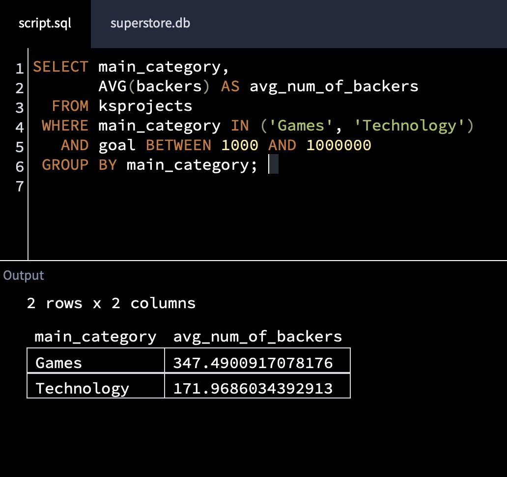
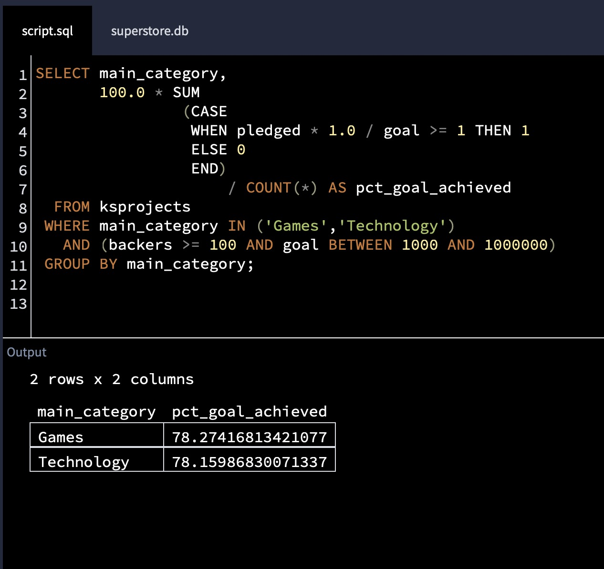
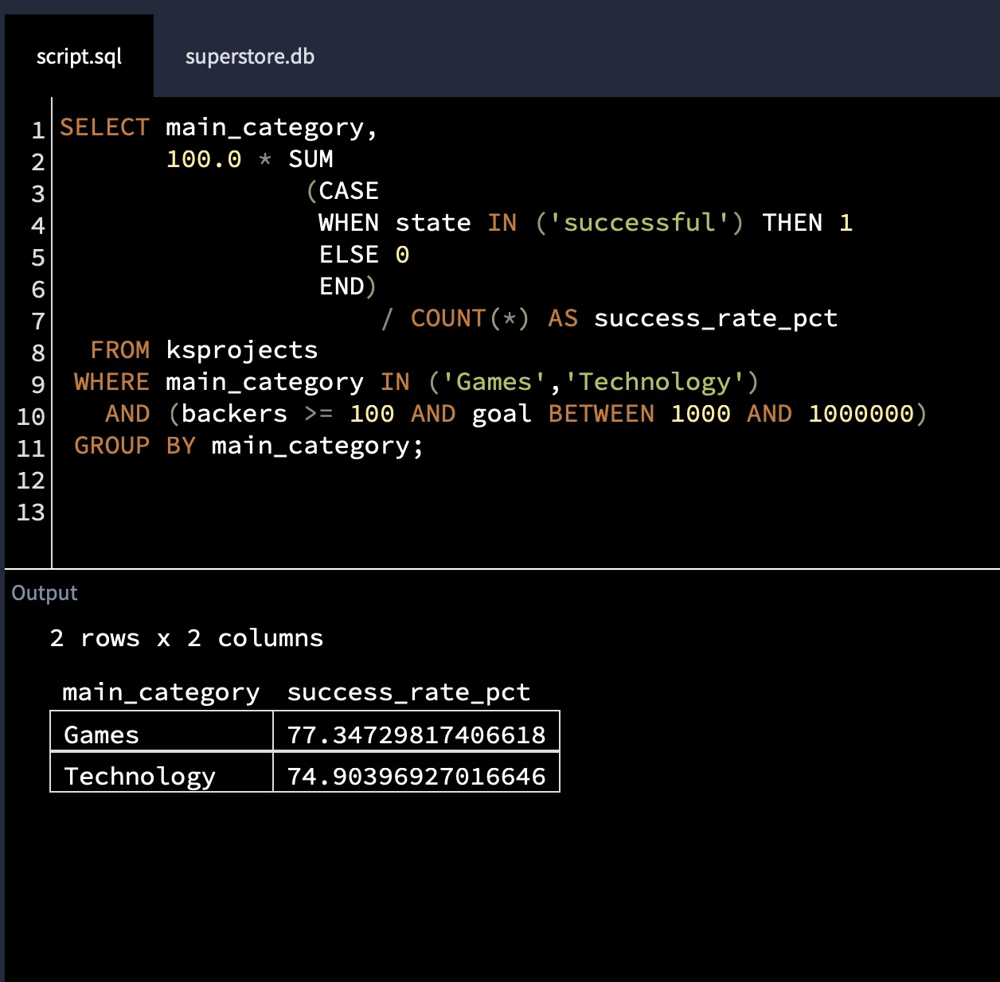

# SQL Analysis of Kickstarter Projects

## Project Description
This project compares the performance of **Games** and **Technology** campaigns on Kickstarter. Using SQL, the analysis evaluates average backers, funding goal attainment, official success rates, and post-funding outcomes to identify differences in success patterns between the two categories.

## Data Source Disclaimer
The dataset used in this project is a curated version of the Kickstarter Projects dataset provided by **Dataquest**, originally sourced from Kaggle. While the dataset comes from Dataquest, all research questions, analysis, and conclusions were developed independently.

To comply with usage and copyright guidelines, the raw dataset is **not included**; instead, screenshots of queries and results are provided in the `SQL_Kickstarter` folder.

---

## Research Questions & Analysis

### 1. Do Games or Technology projects have a greater average number of backers?

**Query Description:**  
This query calculates the average number of backers for Games and Technology projects. Projects with funding goals below $1,000 or above $1,000,000 are excluded to reduce the impact of extreme outliers. Results are grouped by category to enable a direct comparison.

**SQL Query & Results:**  

**Interpretation:**  
Games projects average **347 backers per project**, while Technology projects average **172 backers**. This suggests that Games campaigns attract substantially more individual supporters on average within the selected funding range.

---

### 2. What percentage of Games and Technology projects achieve their funding goals?

**Query Description:**  
This query calculates the percentage of projects that reach or exceed their funding goal. The analysis focuses on projects with funding goals between $1,000 and $1,000,000 and at least 100 backers to ensure comparability. A `CASE WHEN` statement identifies projects that achieved their goal, and the percentage is calculated relative to the total number of projects in each category.

**SQL Query & Results:**  

**Interpretation:**  
78.27% of Games projects reach their funding goal, compared to 78.16% of Technology projects. While both categories show similar funding attainment rates, Games projects perform marginally better under these criteria.

---

### 3. Which category, Games or Technology, has a higher success rate?

**Query Description:**  
This query calculates the official success rate based on project status. A project is considered successful if its state is labeled ‘successful’. Using the same filtered dataset as above, the query determines the percentage of projects officially marked as successful within each category. Unlike the previous question, this analysis relies on Kickstarter’s **official project classification**.

**SQL Query & Results:**  

**Interpretation:**  
Games projects show a success rate of **77.35%**, compared to **74.90%** for Technology projects. This indicates that Games projects are more likely to achieve an officially successful outcome.

---

### 4. Among projects that meet their funding goals, how many do not succeed due to cancellation, suspension, or other factors?

**Findings:**  
- Games projects: 0.92% of projects reached their goal but were not officially successful  
- Technology projects: 3.18% discrepancy between funding goal achievement and final status

**Interpretation:**  
These differences indicate that a small proportion of projects reach their funding goals but are not ultimately classified as successful. The discrepancy is more pronounced in Technology projects, suggesting that post-funding issues occur more frequently in this category.

---

## Conclusion
Across multiple performance metrics — including average backers, funding goal attainment, official success rates, and discrepancies between funding achievement and final project status — **Games projects consistently outperform Technology projects** within the analyzed funding range. Overall, the results suggest that Games campaigns have a consistently higher likelihood of success compared to Technology campaigns.
